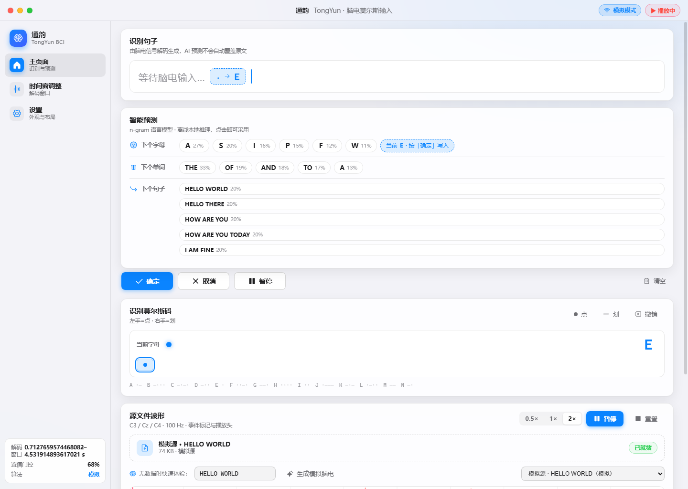

# 通韵 TongYun BCI Web

🧠 基于 **tongyun--bci** 与 **tongyun-bci-algorithm** 的脑电-莫尔斯码识别软件前端：macOS 风格的三栏式界面，左侧控制栏（主页面 / 时间窗调整 / 设置），右侧显示区域。



## ✨ 功能

### 主页面
- **识别句子**（主显示区）：脑电信号解码出的句子实时呈现，AI 建议从不静默覆盖原文，纠错必须人工点「接受」
- **三层智能预测**（离线 n-gram 语言模型，纯前端推理）：
  - 下个字母：按当前点划前缀 + 词前缀概率排序
  - 下个单词：1-gram/2-gram 插值 + 前缀补全
  - 下个句子：常用语句模板 + 2-gram 束搜索扩展
- **确定 / 取消 / 暂停**：确认当前字母或选中的预测、撤销、暂停回放（支持键盘：`.` `←` 点、`-` `→` 划、`Enter` 确定、`Backspace` 撤销）
- 下半区：**识别莫尔斯码**（点划流 + 当前字母 + 手动输入）与**源文件波形**（C3/Cz/C4 三通道 Canvas 渲染、事件标记、播放头、0.5×/1×/2× 回放、文件拖拽上传）

### 时间窗调整
- 对应算法仓库的 0.5–4.0 s epoch 约定（100 Hz 下 351 采样点）
- 拖动两侧手柄调整起止、拖动中间平移整窗、数值输入、常用预设
- 应用后作用于新解析的 GDF/EDF/FIF；送入模型前统一重采样回 3×351，保持与训练分布一致

### 设置
- 主题：浅色 / 深色 / 跟随系统，8 种 macOS 强调色
- 布局：下半区上下堆叠 / 左右并排
- 板块显隐：识别句子、三层预测、莫尔斯码、波形图均可独立开关
- 置信门控阈值（0.5–0.95）实时应用到算法桥接服务

## 🏗 架构

```
浏览器前端 (React 19 + Vite + TypeScript + Canvas)
        │  /api/*
        ▼
backend/backend.py (纯标准库 HTTP 桥接服务)
        │
        ├─ 1) Hybrid FBC-MIFormer（tongyun-bci-algorithm 仓库，需部署权重 .pt）
        ├─ 2) 回退：频带能量 + LDA（无权重时，用带 769/770 标签的 GDF 一键训练，B0101T 实测 85.8%）
        ├─ 3) 事件流 FIF/EDF：文件自带 1=点 2=划 3=字母边界 4=单词边界 事件码，直接解码
        └─ 4) 模拟模式：无任何数据时合成脑电（含低置信拒识演示），开箱可用
```

三级降级保证任何环境下界面都能完整演示；拿到部署权重后无需改代码，`model_loaded` 自动切换。

## 🚀 快速开始

### 环境

- Python ≥ 3.9：`pip install numpy scipy scikit-learn`（解析 GDF/EDF/FIF 另需 `pip install mne`，加载权重另需 `torch`）
- Node.js ≥ 20 + npm（仅构建前端需要；仓库已含构建产物时不需要）

### 启动

```powershell
# 1. 构建前端（首次）
cd frontend
npm install
npm run build
cd ..

# 2. 启动桥接服务（同时提供页面与算法 API）
python backend\backend.py --repo ..\tongyun-bci-algorithm
#    （若算法仓库装在别处：--repo <路径>；若有部署权重：--model <路径> 或设置 TONGYUN_MODEL_PATH）

# 3. 打开浏览器
#    http://127.0.0.1:8765/
```

Windows 下也可以直接双击 `启动服务.bat`。

**无数据快速体验**：打开 `http://127.0.0.1:8765/#main?demo=HELLO WORLD` 自动生成模拟脑电并回放；
或在波形面板输入文本点「生成模拟脑电」，再点「播放」。

**真实数据**：拖入 `sample-data/hello-world/*.fif`（事件流，可直接解码），
或 `D:\db\BCICIV_2b_gdf\B0101T.gdf`（运动想象 epochs，上传后点「训练 CSP+LDA 回退」获得真实推理）。

### 开发模式

```powershell
cd frontend
npm run dev          # Vite 热更新，/api 自动代理到 127.0.0.1:8765
```

## 🔌 算法接入

- 接口契约沿用 `ALGORITHM_INTEGRATION.md` 约定：`POST /api/algorithm/predict`，epoch 为 `3×351`（C3/Cz/C4，100 Hz，0.5–4.0 s 窗口），返回点/划 + 置信度，低于 0.68 拒绝
- 权重加载顺序：`tongyun_bci_algorithm.HybridFBCMIFormerWrapper`（当前仓库公开包）→ `models.eeg_transformer.EEGConformerWrapper`（旧分支兼容）
- 回退分类器特征选择有据可查：`backend/tools/debug_features.py`（均值/标准差 + μ/β 频带能量 + C3/C4 不对称性 → LDA）

## 🧠 预测模块

`frontend/src/lib/predictor/`：n-gram 语言模型，数据来自公开语料（见下），构建产物已入库，开箱即用：

| 文件 | 说明 |
|---|---|
| `engine.ts` | 字母/单词/句子预测 + 拼写纠错（编辑距离 ≤2） |
| `data/words.ts` | 30,000 高频词 + 词频（Norvig count_1w） |
| `data/bigrams.ts` | 40,000 二元组（Norvig count_2w） |
| `templates.ts` | 60+ 常用沟通语句模板 |

重新生成：`npm run gen:lm`（需先下载语料，见 `scripts/build-lm-data.mjs` 头注释）。
引擎冒烟测试：`node scripts/smoke-engine.mjs`；端到端验证：`node scripts/e2e-verify.mjs`（需系统 Edge 与 `playwright-core`）。

## 🧪 测试

- 后端接口：`GET /api/algorithm/health`、`POST /api/simulation/start`、`POST /api/data/upload` 等（详见 `backend/backend.py` 头部注释）
- E2E（29 项断言）：渲染、手动/键盘输入、确定取消、三层预测、主题/强调色/板块开关、时间窗拖动与平移、FIF 上传回放解码「BELLO WORLD」、纠错接受为「HELLO WORLD」、模拟源生成
- hello world 10 个 FIF 的原始解码与纠错建议与 `HELLOWORLD_TEST_REPORT.md` 结论一致

## 📁 目录结构

```
tongyun-bci-web/
├── backend/
│   ├── backend.py            # 桥接服务（页面 + 算法 API）
│   └── tools/debug_features.py  # 回退分类器特征选择实验
├── frontend/
│   ├── src/
│   │   ├── components/       # 标题栏/侧栏/主页面/时间窗/设置/波形 Canvas
│   │   ├── lib/predictor/    # n-gram 语言模型
│   │   ├── state/store.ts    # zustand 全局状态
│   │   └── styles.css        # macOS 设计系统（明暗双主题）
│   └── scripts/              # 语料构建、冒烟测试、E2E
├── sample-data/hello-world/  # 事件流演示数据（10 个 FIF + manifest）
├── docs/screenshots/         # 界面截图
└── 启动服务.bat
```

## 📄 数据与代码来源

- 语言模型语料：[Norvig n-grams](https://norvig.com/ngrams/)（count_1w / count_2w，CC-BY-NC 4.0）、[google-10000-english](https://github.com/first20hours/google-10000-english)（备用词表）
- 算法模型与评估：<https://github.com/Dviodj/tongyun-bci-algorithm>（Hybrid FBC-MIFormer）
- 事件流测试数据与纠错基线：tongyun--bci 的 `test_helloworld`（见 `sample-data/hello-world/README.md`）

## 📤 上传到 GitHub

见 [UPLOAD_GUIDE.md](UPLOAD_GUIDE.md)。

## 📄 许可

MIT License（见 LICENSE）。语言模型语料部分遵循 Norvig 语料的 CC-BY-NC 4.0。
